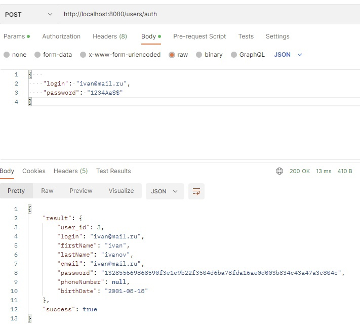
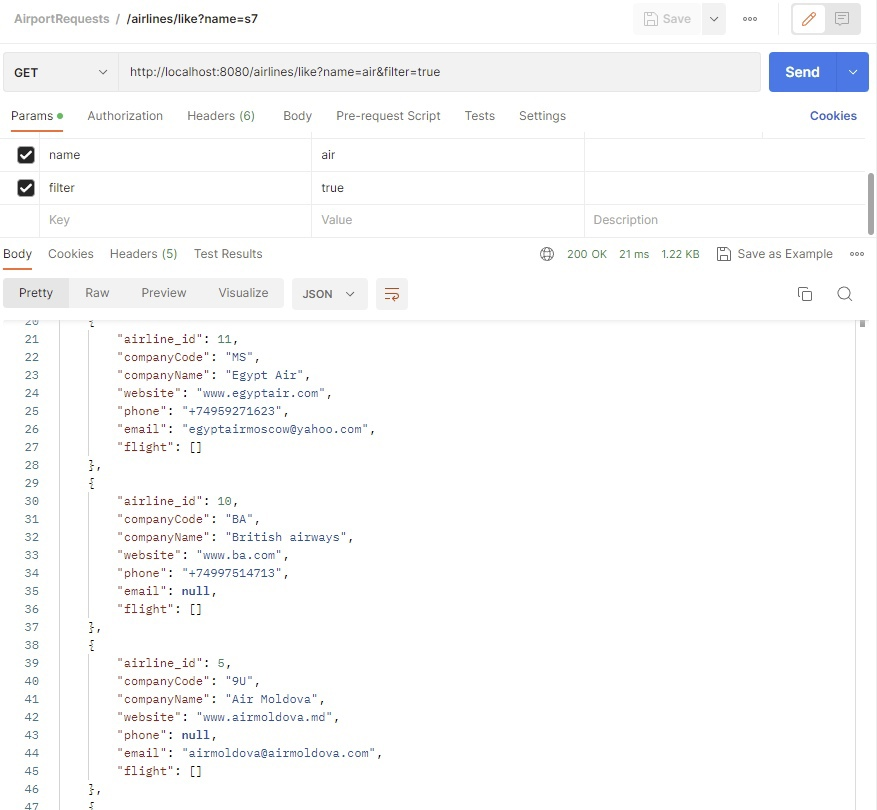
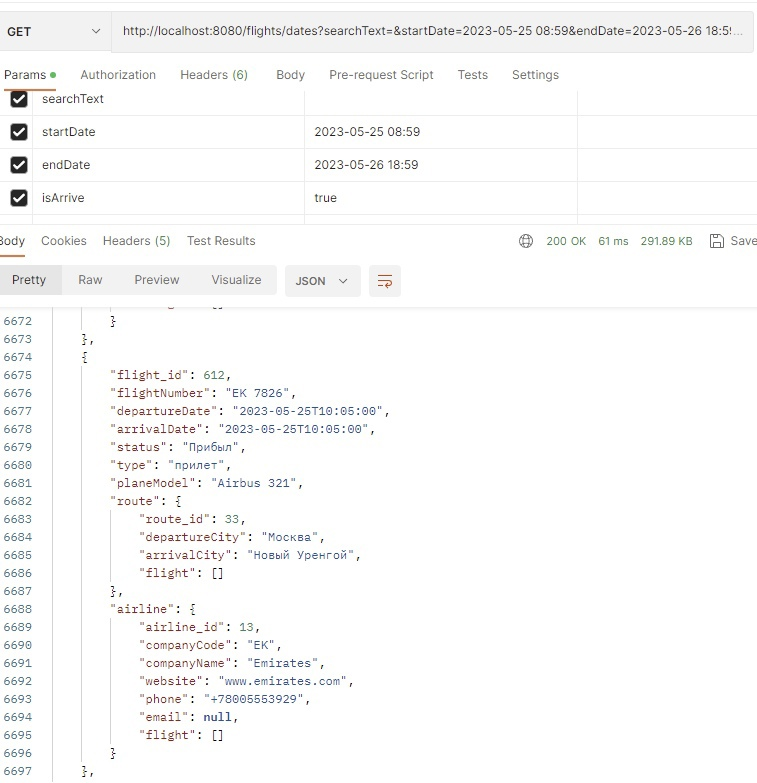

# AirportServer. Курсовая работа.
## Серверная часть Информационно-справочной системы аэропорта.  

---
Данный проект является RESTful Web сервисом на Java, в основе которого используется фреймворк SpringBoot. Целью сервиса является предоставление информации о данных аэропорта.

### Основные задачи:

* **Предоставить информацию о вылете и прибытии в аэропорт**: Дата и время прилета/отправления, номер рейса, аэропорт, терминал, статус, город прибытия и отправления
* **Предоставить информацию о авиакомпаниях**: код авиакомпании, название, вебсайт, номер телефона, почта
* **Фильтрация и поиск записей**: Поиск по номеру рейса, фильтрация по дате вылета или прилета
* **Регистрация пользователя**
* **Аутентификация пользователя**
* **Взаимодействие пользователя с ЛК**: Через личный кабинет можно изменить информацию о пользователе или удалить аккаунт

### Demo API in Postman
Демонстрация небольшой части API в программе Postman

---
<!-- 1 -->

    <h4>Получить список авиакомпаний (GET)</h4>
    

<!-- 2 -->

    <h4>Аутентификация (POST)</h4>
    

<!-- 3 -->

    <h4>Рейсы (GET)</h4>
    

---

### Клиент Desktop App

<a href="https://github.com/Shush1k/AirportClient/tree/main">Клиентская часть приложения (Desktop)</a>